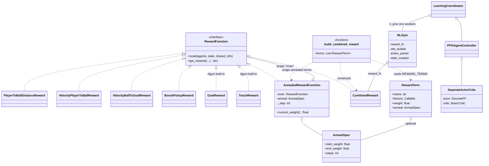

# PILOT

**P**roximal-**I**teration **L**earning **O**ver **T**ime

RL bot for Rocket League. [RLGym v2](https://rlgym.org/) + [RocketSim](https://github.com/ZealanL/RocketSim)
for the env, [`rlgym-learn`](https://github.com/JPK314/rlgym-learn) +
`rlgym-learn-algos` for PPO.

> **Linux only.** `rlgym-learn` 2.0.0's env-process backend crashes on native
> Windows (`FileExistsError: entity already exists` — an epoll/IOCP mismatch in
> its Rust socket registration, unfixed upstream). On Windows, run everything
> below inside WSL2.

## Quickstart

Run in order, in a Linux shell (WSL2 Ubuntu counts).

```sh
# Windows only, first: `wsl --install` in an admin PowerShell, reboot, then
# open the Ubuntu shell and run everything below there. Native Linux: start here.

# 1. System deps: build tools + the libs rlviser's window needs
sudo apt update && sudo apt install -y \
  git python3.12-venv build-essential \
  libxkbcommon-x11-0 libvulkan1 mesa-vulkan-drivers libgl1-mesa-dri libegl1

# 2. Clone into the Linux filesystem (NOT /mnt/c -- RocketSim is ~10x slower there)
cd ~ && git clone <your-repo-url> rocket-league-bot && cd rocket-league-bot

# 3. Python env + deps
python3.12 -m venv .venv
source .venv/bin/activate
pip install -r requirements.txt

# 4. Confirm CUDA is visible (expect: True <your GPU name>)
python -c "import torch; print(torch.cuda.is_available(), torch.cuda.get_device_name(0))"

# 5. rlviser viewer binary -- only needed to watch the sim (RL_RENDER=1)
curl -L -o rlviser https://github.com/VirxEC/rlviser/releases/download/v0.8.2/rlviser
chmod +x rlviser

# 6. Weights & Biases login, once (or skip with: export WANDB_MODE=offline)
wandb login

# 7. Train
python quick_start.py

# ...or train while watching one match in the rlviser window
RL_RENDER=1 RL_N_PROC=1 python quick_start.py

# ...or, if that window never opens or is solid black (see "Watch it train"
# below -- common on WSL2), this launches rlviser natively on Windows and
# points training at it, in one command:
./scripts/watch_train.sh
```

Coming back later in a new shell: `cd ~/rocket-league-bot && source .venv/bin/activate`.

`torch==2.13.0+cu126` needs a driver new enough for CUDA 12.6. CPU-only box?
`pip install torch==2.13.0 --index-url https://download.pytorch.org/whl/cpu`
instead (device is auto-detected, override with `RL_DEVICE`).

## Requirements

- Linux x86_64 (native or WSL2)
- Python 3.12
- NVIDIA GPU for training (CPU works, just slower — RocketSim, not the net, is
  usually the bottleneck anyway)

## Running

```sh
python quick_start.py    # full run: 2v2 self-play, 1B steps
python speed_test.py     # throughput benchmark: 1v1, short timeout, 10M steps
```

Both rewrite `config.json` on startup, then start the `LearningCoordinator`.

- **Watch it train:** `RL_RENDER=1 RL_N_PROC=1 python quick_start.py` opens an
  `rlviser` window on env process 0 (needs a local display, not over plain SSH
  or inside a display-less Docker container). Env process 0 steps with no
  artificial pacing, and the renderer reports the real measured wall-clock
  gap between steps to rlviser, so playback tracks the sim's true speed —
  faster or slower than real time — instead of a fixed multiplier. Expect it
  to run well above real time on a free CPU; use rlviser's live game-speed
  control (or its `settings.txt`) if you want to slow the view down.

  **On WSL2, run `./scripts/watch_train.sh` instead of the command above.**
  No need to `source .venv/bin/activate` first — it finds `.venv/bin/python`
  itself. WSLg's graphics path frequently has no GPU acceleration available
  at all (check `ls /dev/dri` inside WSL — if it's missing, this is you):
  `libEGL` falls back to `dri2` then `zink` and both fail
  (`ZINK: failed to choose pdev`), so an in-WSL `rlviser` either crashes
  outright or renders nothing but a solid black window behind WSLg's
  `[WARN:COPY MODE]` RDP fallback. `rlviser` only exchanges UDP packets with
  the training process, so `watch_train.sh` instead launches the identical
  tool *natively on Windows* (via WSL interop — nothing to run by hand on
  the Windows side) and points training at that, sidestepping WSLg's
  graphics stack entirely. It also moves the local Linux `rlviser` binary
  aside so `rlviser_py` doesn't also spawn a redundant broken copy.

  Getting the native-Windows path fully working took two fixes, both baked
  into `watch_train.sh` already — worth knowing about if this ever needs
  revisiting (e.g. after bumping the `rlviser` version):
  - The **official** Windows `rlviser.exe` has a real bug: an unconnected
    UDP socket that sends to a peer with nobody listening yet gets an ICMP
    "port unreachable" back, and Windows (unlike Linux) surfaces that as
    `WSAECONNRESET` on the socket's *next*, unrelated `recv()` call. That
    silently kills rlviser's one long-lived UDP receive thread within
    milliseconds of every startup, before training has even connected, so
    no packet is ever processed again — symptom: the ball renders (from
    whatever default state happened to load) but the stadium/goals/cars
    never spawn. `watch_train.sh` launches a custom from-source build,
    `rlviser_windows_fixed.exe`, instead — identical to upstream except it
    disables that behavior via the documented `SIO_UDP_CONNRESET` socket
    ioctl right after binding. That binary (and its two side-car DLLs —
    Bevy's `dynamic_linking` feature needs them shipped alongside it) is
    gitignored; rebuild it from `~/rlviser-debug-build` in WSL via
    `cargo xwin build --release --target x86_64-pc-windows-msvc` if it's
    ever missing.
  - Separately, WSL2's UDP loopback forwarding (WSL → Windows via
    `127.0.0.1`, which `rlviser_py` always targets) can silently stop
    working after a reboot on some machines. `watch_train.sh` starts
    `scripts/wsl_udp_relay.py` in the background as a workaround: it binds
    `127.0.0.1` (which always works for purely-local delivery inside WSL)
    and forwards every packet on to the real Windows host IP instead — no
    sudo needed. (A kernel-level `iptables` DNAT rule was tried first and
    made things worse — Linux's `route_localnet` restriction rejects
    sending a loopback-destined packet out a non-loopback interface even
    after NAT rewrites the destination.)
  - With both of the above fixed, a third symptom showed up: the view
    would render the stadium once, then freeze completely — clock stuck,
    ball/cars stuck at spawn. At this project's actual training speed
    (fully uncapped — tens of thousands of `render()` calls/sec), the
    single-threaded Python relay above can't always keep up, causing
    occasional bursty/reordered delivery on the Windows side. The
    official rlviser source treats *any* such hiccup as fatal — one stray
    or out-of-order packet permanently kills its one UDP receive thread,
    freezing the view for the rest of the run. `rlviser_windows_fixed.exe`
    also patches this: it now logs and drops a bad packet instead of
    dying, which is the right behavior for a live visual monitor anyway
    (losing an occasional frame is imperceptible; dying forever isn't).

  If launching the `.ps1` fails with a `running scripts is disabled on this
  system` error, that's just PowerShell's default execution policy —
  `watch_train.sh` already passes `-ExecutionPolicy Bypass`, scoped to that
  one process only (not a persistent system-wide change), so this should
  no longer come up.

  If there's no Windows GUI available at all (e.g. a true headless/SSH-only
  box), `scripts/watch_train_wsl_software.sh` forces Mesa's software
  rasterizer as a last resort — it avoids the immediate crash but is not a
  reliable way to actually watch a match (same black-window issue, and it
  can still segfault after a few minutes under sustained load).
- **Evaluate a checkpoint cleanly:** `RL_RENDER=1` shows stochastic
  mid-collection play with resets on every goal/timeout. For a real read, write
  a short script that loads `agent_controller_checkpoints/<run>/<step>/`,
  rebuilds the env with `RLViserRenderer`, and steps it with greedy actions.
- **Logs:** Weights & Biases is on by default (`wandb login` once, or
  `WANDB_MODE=offline` for local-only, or `RL_WANDB=0` to disable). Runs log
  under entity `cpollreis`, project `rlgym-learn`, group `rlgym-learn-testing`.

### Environment variables

| Var | Default | What it does |
| --- | --- | --- |
| `RL_DEVICE` | auto | `cpu` / `cuda:0` / `cuda:1` for the learner. Auto picks CUDA if available. |
| `RL_N_PROC` | `8` | Parallel env processes. Start around (physical cores − 2); use `1` when watching. |
| `RL_RENDER` | `0` | `1` renders env 0 in an `rlviser` window, in real time (uncapped). |
| `RL_WANDB` | `1` | `0` disables W&B, falls back to console logging. |

## Reward function

`reward_shaping.py` holds the building blocks (dense terms, an
annealing wrapper, an assembler) and has no opinion on weights — the design
itself lives in `quick_start.py`'s `REWARD_TERMS` list, the one place to edit
what the agent is rewarded for.

It's a weighted sum of terms: a sparse `goal` reward carries the real
objective, and dense shaping terms are linearly annealed to (near) zero over
training so they guide the early policy, then get out of the way.

| Term | Weight / schedule | What it rewards |
| --- | --- | --- |
| `goal` | `10.0` (constant) | Scoring/conceding — the real objective. |
| `touch` | `0.1` (constant) | Touching the ball. |
| `boost_pickup` | `0.02` (constant) | Boost gained since last step (pickups only). |
| `dist_to_ball` | `0.05 → 0.0` @ 200k steps | Proximity to the ball. |
| `vel_to_ball` | `0.1 → 0.0` @ 200k steps | Driving toward the ball. |
| `ball_vel_to_goal` | `0.1 → 0.02` @ 500k steps | Hitting the ball toward the opponent's net. |

Placeholders wired up to run end-to-end, not a tuned design. `steps` counts
this *process's* env steps, not global timesteps — each of the `n_proc`
workers anneals independently (`steps = X% * timestep_limit / n_proc`).

## Hyperparameters

Named constants at the top of `quick_start.py`'s `__main__`, not the library's
pydantic defaults — that's the one place to look or edit.

| Constant | Value | Tunes |
| --- | --- | --- |
| `GAMMA` | `0.99` | Discount factor γ — how much future reward counts today. |
| `GAE_LAMBDA` | `0.95` | GAE bias/variance trade-off — near 0 trusts the critic, near 1 trusts raw returns. |
| `CLIP_RANGE` | `0.2` | PPO trust region ε — bounds the policy-ratio clip to `[1-ε, 1+ε]`. |
| `ENT_COEF` | `0.01` | Entropy bonus — higher pushes more exploration. |
| `LR_ACTOR` / `LR_CRITIC` | `5e-5` | Adam learning rates. |
| `N_EPOCHS` | `1` | Passes over each collected batch. |
| `BATCH_SIZE` | `50_000` | Timesteps per learning batch. |
| `N_MINIBATCHES` | `1` | Minibatches per epoch. |
| `MAX_GRAD_NORM` | `0.5` | Gradient clipping. |
| `REWARD_CLIP` | `10.0` | Clamps per-step reward before GAE. |
| `EXPERIENCE_BUFFER_SIZE` | `150_000` | Rolling timestep window kept for training. |
| `TIMESTEPS_PER_ITERATION` | `50_000` | Timesteps collected between learner updates. |

Also relevant: `n_proc` (`RL_N_PROC`) and the network shape — a 3x256 MLP for
both actor and critic (`actor_critic_factory`). All of the above gets dumped
to `config.json` at the start of every run.

## Repo design

`quick_start.py` composes an RLGym `env` (obs/action/reward/state pieces) and
an `rlgym_learn` `LearningCoordinator` (env-process pool + PPO learner) that
drives it. `reward_shaping.py` supplies the `reward_fn` half of that env.



| Path | What |
| --- | --- |
| `quick_start.py` | Entry point — builds the env, wires up hyperparameters, starts training. |
| `reward_shaping.py` | Reward building blocks (`RewardFunction` subclasses, `AnnealedRewardFunction`, `build_combined_reward`). |
| `speed_test.py` | Throughput benchmark variant (1v1, short timeout, 10M steps). |
| `scripts/watch_train.sh` | Run in WSL: launches native Windows `rlviser_windows_fixed.exe` (via `launch_rlviser_windows.ps1`, over WSL interop), starts `wsl_udp_relay.py` in the background, and runs `quick_start.py` pointed at both — instead of an in-WSL `rlviser`. |
| `scripts/launch_rlviser_windows.ps1` | Launches `rlviser_windows_fixed.exe` natively for full GPU acceleration. Throws if that binary is missing (it's a custom from-source build, not something to download — see "Watch it train" above). Called automatically by `watch_train.sh`; run directly on Windows only if WSL interop is unavailable. |
| `scripts/wsl_udp_relay.py` | Run automatically by `watch_train.sh`: relays UDP packets sent to `127.0.0.1` inside WSL out to the real Windows host IP, working around WSL2's loopback forwarding not working on this machine (see "Watch it train" above). |
| `scripts/watch_train_wsl_software.sh` | Last-resort fallback: forces Mesa's software rasterizer for an in-WSL `rlviser`. Avoids the immediate crash but not a reliable way to actually watch a match. |
| `scripts/sync_to_wsl.sh` | Run from WSL: one-way mirrors a Windows-side checkout of this repo (e.g. `C:\...`) into the WSL clone, for anyone editing on the Windows side while testing in WSL. |
| `config.json` | Rewritten from the script every run — safe to delete. |
| `agent_controller_checkpoints/` | Checkpoints. The trainer owns this folder and may delete anything in it. |
| `wandb/` | Local W&B data. |
| `Dockerfile` | Training + sim container. |

Checkpoints land in `agent_controller_checkpoints/<run>/<step>/`. To resume
from one, set `checkpoint_load_folder` in the PPO config in `quick_start.py`.

## Docker

For a Linux CUDA box. `Dockerfile` uses `pytorch/pytorch:<tag>-runtime` (pick a
tag whose torch matches `requirements.txt`); cross-arch builds run pip under
emulation and are slow.

```sh
docker build -t rl-bot .

docker run --rm -it --gpus all -v "$(pwd)":/app \
  -e WANDB_API_KEY="$WANDB_API_KEY" rl-bot python quick_start.py
```

The bind mount keeps code, `config.json`, checkpoints, and `wandb/` on the host
so they survive `--rm`. To watch a containerized run, run `rlviser` on a real
Linux host (not Docker Desktop) and start the container with `--network host`
so the loopback UDP stream reaches it.
